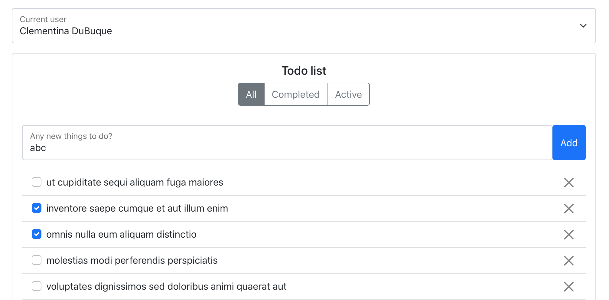

This is a simple project utilizing the https://jsonplaceholder.typicode.com/todos api to modify a todos list.

## Setting it up

In the project directory, you can run:

### `npm install`

To install all the required packages for this project. It will also start a static server for you to preview it on.
